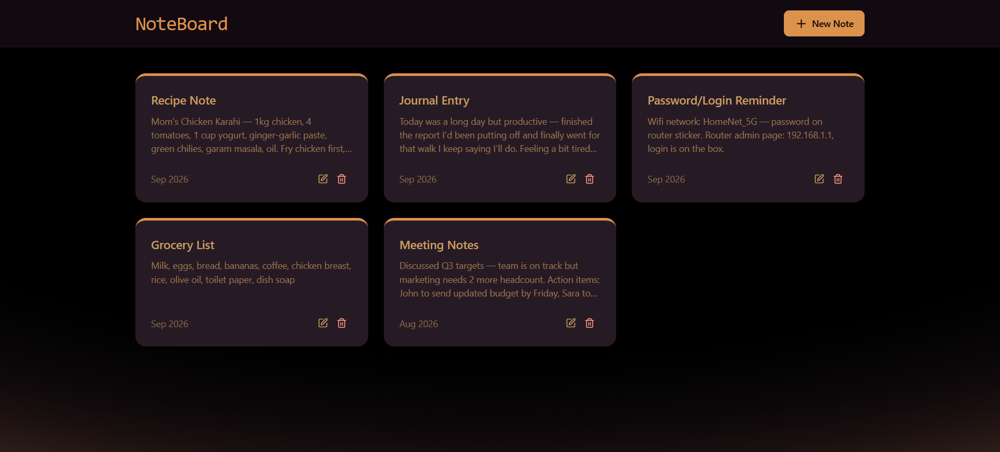
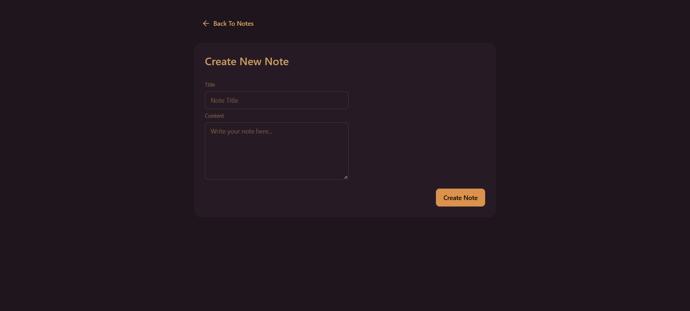

# NoteBoard

NoteBoard is a full-stack note-taking application built with the MERN stack. It allows users to create, view, and manage notes through a React frontend and Node.js/Express backend.

## Tech Stack

### Frontend

* **React** - Building the user interface
* **Vite** - Frontend development and build tool
* **React Router** - Client-side routing
* **Axios** - API requests
* **Tailwind CSS + DaisyUI** - Styling and UI components

### Backend

* **Node.js** - Server-side JavaScript runtime
* **Express.js** - REST API and server framework
* **MongoDB + Mongoose** - Database and data modeling
* **Upstash Redis** - Rate limiting and request control

## Features

* Create and manage notes
* REST API backend
* MongoDB database integration
* Client-side routing
* Responsive UI
* API rate limiting
* Toast notifications
